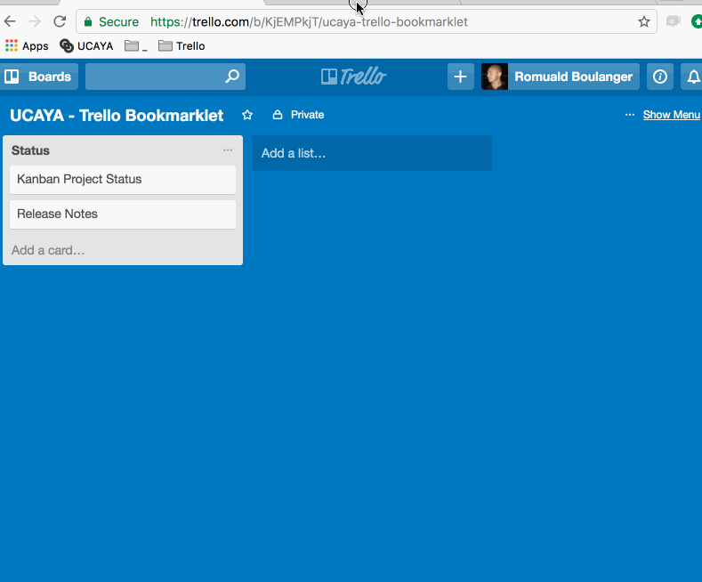
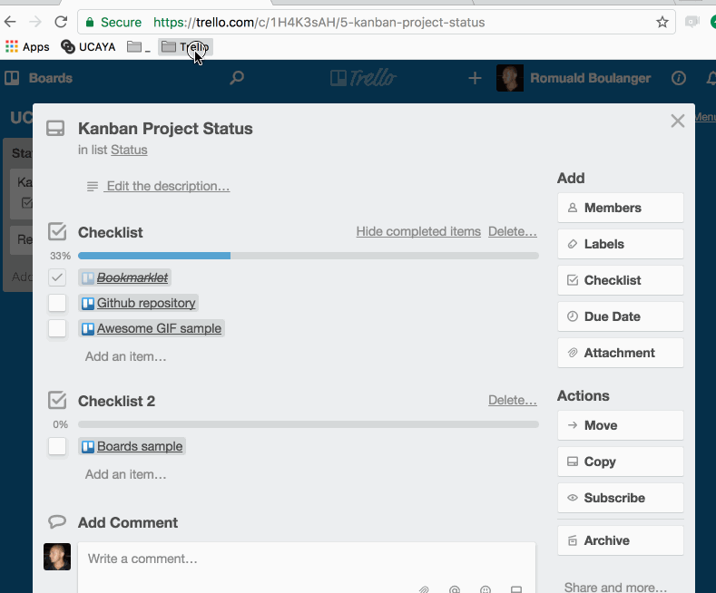
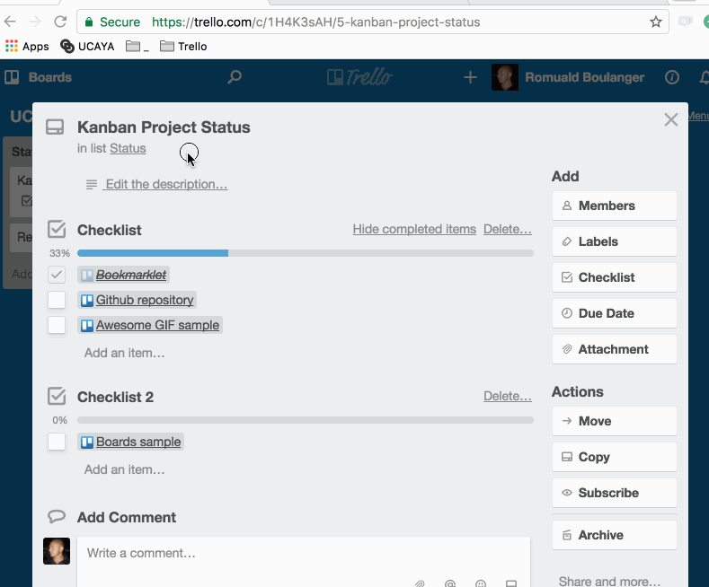
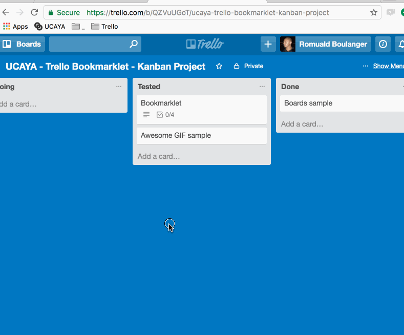

🎓 Just drag link to your bookmarks bar

### Bookmarklets

#### checklist-from-list
Fill checklist in Card from List

How to : Open card, choose Board, List and checklist

[Trello: Fill checklist](javascript:(function(U,C,A,Y,A_,__){__=A.getElementById(U),__&&__.parentNode.removeChild(__),__=A.createElement("script"),__.type="text/javascript",__.async=1,__.id=U,__.src="https://ucaya.github.io/trello-bookmarklets/"+U+"/index.js",A.getElementsByTagName("head")[0].appendChild(__)})("checklist-from-list",window,document,getSelection?getSelection().toString():document.title);)

#### toggle-checklist
Toggle checklist on Card

How to : Open card, then you can toggle all checklists or just one when you click on it

[Trello: Toggle checklist](javascript:(function(U,C,A,Y,A_,__){__=A.getElementById(U),__&&__.parentNode.removeChild(__),__=A.createElement("script"),__.type="text/javascript",__.async=1,__.id=U,__.src="https://ucaya.github.io/trello-bookmarklets/"+U+"/index.js",A.getElementsByTagName("head")[0].appendChild(__)})("toggle-checklist",window,document,getSelection?getSelection().toString():document.title);)

#### card-to-markdown
Export card in markdown

How to : Open card, then you can copy the markdown

[Trello: Card to markdown](javascript:(function(U,C,A,Y,A_,__){__=A.getElementById(U),__&&__.parentNode.removeChild(__),__=A.createElement("script"),__.type="text/javascript",__.async=1,__.id=U,__.src="https://ucaya.github.io/trello-bookmarklets/"+U+"/index.js",A.getElementsByTagName("head")[0].appendChild(__)})("card-to-markdown",window,document,getSelection?getSelection().toString():document.title);)

#### releasenotes
Export Release Notes in markdown from a board

How to : Open board, set "done" list and version name

[Trello: Release Notes](javascript:(function(U,C,A,Y,A_,__){__=A.getElementById(U),__&&__.parentNode.removeChild(__),__=A.createElement("script"),__.type="text/javascript",__.async=1,__.id=U,__.src="https://ucaya.github.io/trello-bookmarklets/"+U+"/index.js",A.getElementsByTagName("head")[0].appendChild(__)})("releasenotes",window,document,getSelection?getSelection().toString():document.title);)

#### linked-cards
Display linked cards

How to : Open card, then you see linked cards

[Trello: Linked cards](javascript:(function(U,C,A,Y,A_,__){__=A.getElementById(U),__&&__.parentNode.removeChild(__),__=A.createElement("script"),__.type="text/javascript",__.async=1,__.id=U,__.src="https://ucaya.github.io/trello-bookmarklets/"+U+"/index.js",A.getElementsByTagName("head")[0].appendChild(__)})("linked-cards",window,document,getSelection?getSelection().toString():document.title);)

#### export-excel-file
Export cards to Excel file

How to : Open board, then you can export cards in Excel file

[Trello: Export Excel file](javascript:(function(U,C,A,Y,A_,__){__=A.getElementById(U),__&&__.parentNode.removeChild(__),__=A.createElement("script"),__.type="text/javascript",__.async=1,__.id=U,__.src="https://ucaya.github.io/trello-bookmarklets/"+U+"/index.js",A.getElementsByTagName("head")[0].appendChild(__)})("export-excel-file",window,document,getSelection?getSelection().toString():document.title);)

### Thanks

To [@limonte](https://github.com/limonte) for [https://github.com/limonte/sweetalert2](https://github.com/limonte/sweetalert2)

To [@chriszarate](https://github.com/chriszarate) for [https://github.com/chriszarate/bookmarkleter](https://github.com/chriszarate/bookmarkleter)
