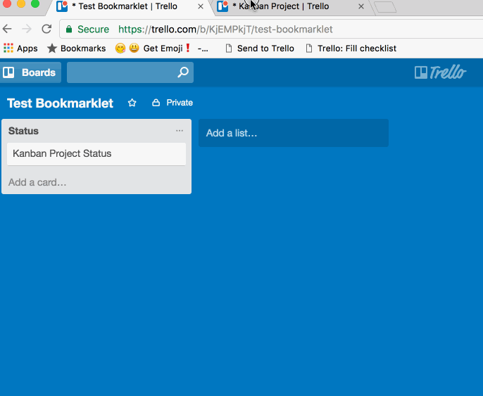

# trello-bookmarklets

Bookmarklets for Trello

Just drag link to your bookmarks bar

### Bookmarklets
#### checklist-from-list

Fill checklist in Card from List

[Trello: Fill checklist](javascript:void%20function(){(function(){var%20o=$.cookie(%22token%22),e=/\/c\/([^\/]+)/.exec(document.location);if(!e)return%20alert(%22No%20cards%20are%20open.%22),!1;var%20t=e[1],s=null,c=null,n=null,r=[];$.get(%22/1/cards/%22+t,{fields:%22idList%22,checklists:%22all%22}).success(function(e){for(var%20t=(e.idList,e.checklists),i=0;i%3Ct.length;i++){var%20l=t[i];if(0===l.name.indexOf(%22%23%22)){s=l.id;var%20a=l.name.split(%22%20%22);try{c=a[1],n=a[2]}catch(f){console.log(%22STEP%201:%20No%20checklist%20to%20fill%22)}console.log(%22STEP%201:%20fromBoardId:%20%22+c+%22%20fromListName:%20%22+n);break}}if(!c%26%26!n)return%20alert(%22No%20checklist%20to%20fill.%22),!1;$.get(%22/1/boards/%22+c+%22/lists%22,{}).success(function(o){for(var%20e=o,t=0;t%3Ce.length;t++){var%20s=e[t];if(s.name===n){n=s.id,console.log(%22STEP%202:%20fromListId:%20%22+n);break}}$.get(%22/1/boards/%22+c+%22/cards%22,{}).success(function(o){for(var%20e=o,t=0;t%3Ce.length;t++){var%20s=e[t];s.idList===n%26%26r.push(s)}console.log(%22STEP%203:%20fromCards:%20%22+JSON.stringify(r)),u()})});var%20u=function(){if(0==r.length)return!1;var%20e=r.shift(),t=e.url;$.post(%22/1/checklists/%22+s+%22/checkItems%22,{token:o,name:t,pos:%22bottom%22}).success(function(o){console.log(%22STEP%204:%20createNextItem:%20%22+t),u()})}})})()}();)

How to : Open card, name your Checklist "# {idBoard} {listName}"

#### toggle-checklist

Toggle checklist on Card

[Trello: Toggle checklist]()

How to : Open card, then you can toggle all checklists or just one when you click on it

#### releasenotes-to-clipboard

Create Release Notes in markdown from a board

[Trello: Create Release Notes](javascript:void%20function(){var%20e=/\/b\/([^\/]+)/.exec(document.location);if(!e)return%20alert(%22Your%20not%20on%20Trello%20board.%22),!1;if(!window.releasenotesToClipboardIsInit){var%20n=document.getElementsByTagName(%22head%22)[0],t=document.createElement(%22link%22);t.id=%22sweetalert2-css%22,t.rel=%22stylesheet%22,t.type=%22text/css%22,t.href=%22https://cdnjs.cloudflare.com/ajax/libs/limonte-sweetalert2/6.6.0/sweetalert2.min.css%22,t.media=%22all%22,n.appendChild(t),t=document.createElement(%22script%22),t.id=%22sweetalert2-js%22,t.type=%22text/javascript%22,t.src=%22https://cdnjs.cloudflare.com/ajax/libs/limonte-sweetalert2/6.6.0/sweetalert2.min.js%22,n.appendChild(t),window.releasenotesToClipboardIsInit=!0}var%20l=e[1],s=[],o=function(e,n){var%20t=function(e){return%20e.name.toLowerCase()===n},l=e.labels%26%26e.labels.length%3E0%3Fe.labels.findIndex(t):-1;return%20l%3E-1},a=function(e){return%20o(e,%22enhancement%22)},r=function(e){return%20o(e,%22bug%22)},i=function(e){return!r(e)%26%26!a(e)};console.log(%22STEP%201:%20idBoard:%20%22+l),$.get(%22/1/boards/%22+l+%22/lists%22,{cards:%22open%22,card_fields:%22url,name,labels%22}).success(function(e){for(var%20n='%3Cselect%20id=%22swal-list%22%20class=%22swal2-input%22%3E',t=0;t%3Ce.length;t++){var%20l=e[t],o=%22done%22===l.name.toLowerCase()%3F'selected=%22selected%22':%22%22;n+='%3Coption%20value=%22'+l.name+'%22%20'+o+%22%3E%22+l.name+%22%3C/option%3E%22}n+=%22%3C/select%3E%22,swal({type:%22question%22,title:%22Release%20Notes%22,confirmButtonText:%22🖨%20Go!%22,html:%22🗃%20List%3F%22+n+'📦%20Version%3F%3Cinput%20id=%22swal-version%22%20class=%22swal2-input%22%20placeholder=%22Build%20number%22%3E',preConfirm:function(){return%20new%20Promise(function(e){e([$(%22%23swal-list%22).val(),$(%22%23swal-version%22).val()])})},onOpen:function(){$(%22%23swal-list%22).focus()}}).then(function(n){var%20t=n[0],l=n[1];console.log(t),console.log(l);var%20o=e.find(function(e){return%20e.name.toLowerCase()===t.toLowerCase()});s.push(%22%23%20📦%20%22+(new%20Date).toLocaleString()),s.push(%22\n%22),s.push(%22%23%23%20%22+l),s.push(%22\n%22);var%20c=o.cards.filter(i);if(c%26%26c.length%3E0){console.log(%22⭐️%20New:%20%22+c.length),s.push(%22%23%23%20⭐️%20New%22);for(var%20u=0;u%3Cc.length;u++){var%20d=c[u];s.push(%22-%20[$name$]($url$)%22.replace(%22$name$%22,d.name).replace(%22$url$%22,d.url))}s.push(%22\n%22)}if(c=o.cards.filter(a),c%26%26c.length%3E0){console.log(%22👍%20Updated:%20%22+c.length),s.push(%22%23%23%20👍%20Updated%22);for(var%20u=0;u%3Cc.length;u++){var%20d=c[u];s.push(%22-%20[$name$]($url$)%22.replace(%22$name$%22,d.name).replace(%22$url$%22,d.url))}s.push(%22\n%22)}if(c=o.cards.filter(r),c%26%26c.length%3E0){console.log(%22🐛%20Fixed:%20%22+c.length),s.push(%22%23%23%20🐛%20Fixed%22);for(var%20u=0;u%3Cc.length;u++){var%20d=c[u];s.push(%22-%20[$name$]($url$)%22.replace(%22$name$%22,d.name).replace(%22$url$%22,d.url))}s.push(%22\n%22)}s.push(%22%23%23%20⚠️%20Known%20Issues%22),s.push(%22\n%22),console.log(s),console.log(%22STEP%20END:%20copy%20to%20clipboard%22),swal({type:%22success%22,title:%22All%20done!%22,html:'Your%20Release%20Notes:%3Ctextarea%20rows=%2210%22%3E'+s.join(%22\n%22)+%22%3C/textarea%3E%22,confirmButtonText:%22Lovely!%22,showCancelButton:!1})})[%22catch%22](swal.noop)})}();)

How to : Open board, set "done" list and version name

### Thanks

Thanks to [@chriszarate](https://github.com/chriszarate) for [https://github.com/chriszarate/bookmarkleter](https://github.com/chriszarate/bookmarkleter)
